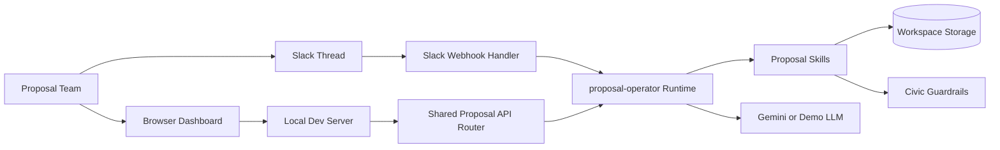
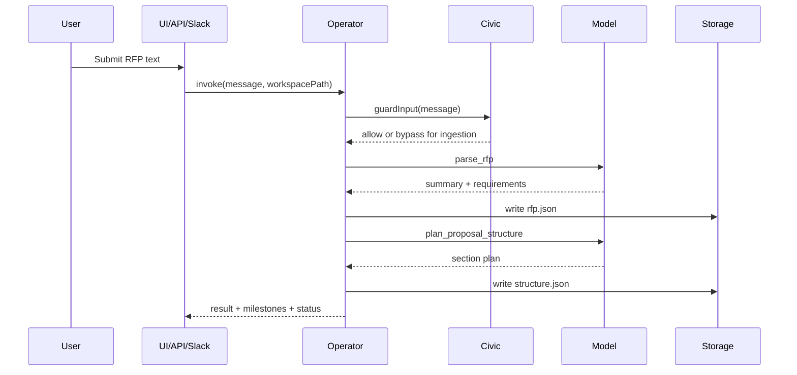

# System Architecture: Proposal Helmsman

## Overview

Proposal Helmsman is a Slack-first AI proposal operations system that helps teams turn raw RFP content into a structured proposal draft. The current implementation is an MVP focused on a single coherent workflow: ingest an RFP, extract and track requirements, plan a proposal structure, draft and revise sections, apply Civic guardrails, and export a combined proposal document.

Architecturally, the system is a lightweight modular monolith implemented in Node.js, with three entry surfaces that share the same core logic: a browser dashboard, a programmatic HTTP API, and a Slack-compatible webhook handler. The design favours a shared runtime and skill layer over early service fragmentation, so the proposal workflow, guardrails, storage, and transport layers can evolve independently as the product moves from hackathon prototype to production service.

## Key Requirements

- Accept proposal work through Slack threads and browser-based local/demo workflows.
- Create an isolated workspace per conversation or proposal thread.
- Parse pasted RFP text into a summary and structured requirement list.
- Draft, revise, and export proposal content while keeping humans in control.
- Track requirement coverage and surface supporting evidence from drafted sections.
- Apply input, tool, and output guardrails to reduce unsafe commitments and sensitive disclosures.
- Support both demo mode and live model mode with a configurable Gemini-compatible client.
- Remain easy to run locally while allowing migration towards durable hosted deployment.
- Protect sensitive proposal content through request verification, bounded file access, and conservative error handling.
- Keep the backend thin enough to support local development and serverless-style deployment targets.

## High-Level Architecture

Proposal Helmsman is organised around a shared proposal workflow core. The browser UI, serverless API handlers, and Slack webhook all route into a common API/runtime layer. That layer invokes the `proposal-operator`, which coordinates proposal skills and stores all artefacts in a workspace directory. External dependencies are deliberately narrow: Gemini provides model inference when configured, and Civic provides policy checks around user input, tool calls, and generated output.

This diagram shows the system context at container level. The important design choice is that all user-facing channels converge on the same operator and skill layer, which keeps behaviour consistent across the dashboard, CLI, API, and Slack entrypoints while preserving a single source of truth for workspace state.

## Component Details

### Web Client

**Responsibilities**

- Provide a browser-based demo and operator console.
- Create and switch workspaces.
- Submit operator commands and display current workspace state.
- Visualise requirement coverage, section status, trust posture, and export state.

**Main technologies**

- Plain HTML, CSS, and JavaScript in `web/`
- Static asset serving through the local Node dev server

**Important data owned**

- Ephemeral browser state only
- No canonical business data is stored in the client

**Communication**

- Calls the local HTTP API under `/api/*`
- Does not call Gemini or Civic directly

### Local Dev Server

**Responsibilities**

- Serve static frontend assets during development and demos.
- Proxy API calls to the shared proposal API router.
- Return structured error payloads for client-friendly handling.

**Main technologies**

- Node.js `http` server in `openclaw/runtime/dev-server.ts`

**Important data owned**

- None beyond request/response lifecycle data

**Communication**

- Serves `web/index.html`, `web/app.css`, and `web/app.js`
- Dispatches API requests to `backend/proposal-api.ts`

### Shared Proposal API Router

**Responsibilities**

- Expose workspace-oriented HTTP endpoints such as health, status, message, reset, and proposal download.
- Normalise request handling across local and serverless execution modes.
- Assemble workspace payloads for the UI and API clients.

**Main technologies**

- Node/Fetch `Request` and `Response` handling in `backend/proposal-api.ts`
- Thin serverless wrappers in `api/`

**Important data owned**

- Aggregated workspace payloads
- Health and storage posture metadata

**Communication**

- Invokes the `proposal-operator` for message workflows
- Reads and writes workspace artefacts through shared storage helpers
- Exposes JSON and markdown responses to callers

### Proposal Operator Runtime

**Responsibilities**

- Interpret operator messages and commands.
- Decide whether to parse an RFP, plan structure, draft content, revise content, update coverage, or export.
- Enforce input guardrails before executing sensitive actions.
- Coordinate status snapshots and milestones for clients.

**Main technologies**

- TypeScript runtime in `openclaw/runtime/proposal-operator.ts`
- Configurable LLM client from `openclaw/runtime/model-client.ts`

**Important data owned**

- Runtime-only command interpretation state
- No durable state outside the workspace directory

**Communication**

- Calls proposal skills directly
- Uses Gemini or the demo LLM for generation
- Calls Civic input guardrails before unsafe actions proceed

### Proposal Skills Layer

**Responsibilities**

- Parse RFP content into `rfp.json`
- Plan the proposal structure into `structure.json`
- Draft and revise section markdown files
- Update requirement coverage and evidence
- Export `proposal.md`
- Return workspace status snapshots

**Main technologies**

- TypeScript skill modules in `openclaw/skills/proposal-operator/`
- Shared filesystem and schema helpers in `shared.ts`

**Important data owned**

- `rfp.json`
- `structure.json`
- `sections/*.md`
- `proposal.md`

**Communication**

- Read/write the workspace filesystem
- Use the configured LLM for parse, plan, draft, and revise tasks
- Use Civic tool and output guardrails where applicable

### Workspace Storage

**Responsibilities**

- Persist all durable proposal artefacts for a workspace.
- Isolate proposal threads from one another.
- Support local filesystem mode and Modal-mounted volume mode.

**Main technologies**

- Filesystem-based storage resolved by `backend/storage-config.ts`
- Workspace helper functions in `openclaw/skills/proposal-operator/shared.ts`

**Important data owned**

- Workspace-level proposal files
- Slack idempotency receipts under `.slack-events/`

**Communication**

- Accessed by the API router, operator runtime, skills, and Slack handler

### Slack Webhook Handler

**Responsibilities**

- Verify Slack request signatures and timestamps.
- Handle Slack URL verification.
- Convert Slack events into workspace-scoped operator invocations.
- Suppress duplicate event processing using `event_id` receipts.

**Main technologies**

- TypeScript webhook handler in `openclaw/examples/slack-handler.ts`
- HMAC verification with Node `crypto`

**Important data owned**

- No canonical proposal data
- Writes event receipts for idempotency

**Communication**

- Receives requests from Slack
- Invokes the proposal operator
- Reads workspace status when status-only replies are requested

### External Integrations

#### Gemini-Compatible Model Client

**Responsibilities**

- Generate structured or text output for parse, planning, drafting, and revision tasks.
- Expose demo fallback behaviour when live credentials are unavailable.

**Main technologies**

- Fetch-based Gemini client in `openclaw/runtime/model-client.ts`
- Deterministic demo model in `openclaw/runtime/demo-llm.ts`

**Important data owned**

- None; requests are stateless

**Communication**

- Called only through the operator runtime or skills

#### Civic Guardrails

**Responsibilities**

- Evaluate inbound text, tool calls, and outbound proposal content.
- Allow, block, or modify risky content.
- Provide a mock mode for offline/local demos.

**Main technologies**

- HTTP client and mock rules in `openclaw/guardrails/civic.ts`

**Important data owned**

- None inside the application; decisions are transient unless logged externally

**Communication**

- Called by the operator runtime and selected skills

## Data Flow

### 1. RFP Ingestion and Structure Planning

1. A user submits raw RFP text through the browser UI, CLI, API, or Slack.
2. The operator creates or opens the workspace for that proposal thread.
3. Civic input guardrails inspect the message unless it is treated as raw RFP ingestion.
4. The parse skill generates a summary and structured requirements, then writes `rfp.json`.
5. The planning skill generates the default proposal structure and writes `structure.json`.
6. The client receives status and milestone information.

This sequence shows the canonical first-run workflow. It matters because the whole system is organised around a workspace becoming progressively richer as each artefact is written.

### 2. Section Drafting, Guarding, and Coverage Update

1. A user requests a draft or revision for a named section.
2. The relevant skill reads `rfp.json`, `structure.json`, and any existing section content.
3. Civic evaluates the tool call or generated output depending on the action.
4. The system writes the section markdown if the result is allowed or modified safely.
5. The coverage skill scans section content and updates the checklist in `rfp.json`.
6. The client receives the refreshed workspace snapshot.

### 3. Slack Event Processing

1. Slack sends a signed event callback.
2. The Slack handler verifies the signature and rejects stale or invalid requests.
3. The event is mapped to a workspace using `(channelId, threadId)`.
4. The handler checks whether the Slack `event_id` has already been processed.
5. If the event is new, the operator runs and the receipt is recorded for idempotency.

## Data Model (High-Level)

The system uses file-based workspace storage rather than a relational database in the current MVP. Each workspace acts as the unit of isolation for one proposal or Slack thread.

### Core Entities

- **Workspace**
  - Identified by a derived workspace ID such as `<channel>_<thread>`
  - Root container for all proposal artefacts
- **RFP Document**
  - Stored in `rfp.json`
  - Contains `summary` and `requirements`
- **Requirement**
  - Fields: `id`, `text`, `must_have`, `covered`, `evidence[]`
  - Evidence links requirements to sections and matched keywords
- **Proposal Structure**
  - Stored in `structure.json`
  - Ordered list of proposal sections
- **Section Draft**
  - Stored as `sections/<safe_name>.md`
  - Holds draft content for one proposal section
- **Proposal Export**
  - Stored as `proposal.md`
  - Concatenated document assembled in structure order
- **Slack Event Receipt**
  - Stored under `.slack-events/`
  - Prevents duplicate event processing

### Relationship Summary

- One workspace contains one RFP document.
- One RFP document contains many requirements.
- One workspace contains one proposal structure.
- One proposal structure references many section drafts.
- One requirement may be evidenced by many section drafts.
- One workspace may contain many Slack event receipts.

## Infrastructure & Deployment

### Current Deployment Model

The repository supports two practical deployment modes today:

- **Local development mode**
  - A Node.js dev server serves static assets and the API from one process.
  - Workspace data is stored on the local filesystem under `workspaces/proposals`.
- **Serverless-style mode**
  - Thin handlers in `api/` reuse the shared proposal API router.
  - Workspace data can be redirected to a mounted durable path, for example a Modal volume or another shared filesystem mount.

### Environments

| Environment | Purpose | Deployment Style | Storage |
| --- | --- | --- | --- |
| `dev` | Local development and demos | Node.js process via `npm run dev` | Local filesystem |
| `staging` | Integration testing, preview validation, and external service smoke checks | Vercel-style serverless handlers or a thin container wrapper | Shared durable filesystem mount or external-backed workspace storage |
| `prod` | Live proposal operations with controlled external integrations | Serverless handlers or container deployment behind HTTPS routing | Durable shared storage with backup and recovery controls |

### Deployment Notes

- The codebase is runtime-light and does not currently require containers or Kubernetes.
- The local OpenClaw-style runtime is embedded in the application rather than deployed as a separate service.
- The storage abstraction is still filesystem-based, even in hosted scenarios.
- A hosted Vercel deployment is feasible for the API surface, but durable workspace storage must be externalised because ephemeral function filesystems are not sufficient for proposal state.
- Static frontend asset serving should be treated as a deploy-time concern separate from workspace persistence and background execution concerns.

## Scalability & Reliability

### Current Approach

- The API layer is effectively stateless apart from workspace filesystem access.
- Workspace isolation reduces cross-request coupling between proposals.
- Slack duplicate suppression prevents accidental re-processing of retried events.
- Structured error payloads make it easier for clients to distinguish validation failures from upstream service failures.
- Health checks expose model mode, Civic posture, and storage mode.

### Current Limits

- File-based storage will become a bottleneck for high-concurrency or multi-instance deployments.
- There is no queue for long-running generation or export jobs.
- There is no distributed lock around concurrent writes to the same workspace.
- Scaling horizontally requires shared durable storage and careful write coordination.

### Recommended Next Steps

- Move workspace artefacts to durable object or database-backed storage.
- Introduce a background job layer for long-running draft and export tasks.
- Add optimistic concurrency or locking for simultaneous updates to the same workspace.
- Cache lightweight workspace summaries if the number of workspaces grows materially.
- Add deployment-specific operational safeguards such as rate limits, queue back-pressure, and workspace retention policies.

## Security & Compliance

### Current Measures

- Slack requests are protected with HMAC signature verification and replay-window checks.
- Duplicate Slack events are ignored using persisted idempotency receipts.
- Workspace path handling guards against path traversal and workspace escape.
- Civic guardrails can block or rewrite unsafe content for input, tool execution, and output.
- Sensitive commitments such as unlimited liability and hard uptime guarantees are explicitly constrained.
- Error responses are structured to avoid accidental leakage of internal stack traces to clients.

### Compliance and Data Protection Considerations

- Proposal content may contain commercially sensitive customer and bid information.
- Workspace data is stored unencrypted at application level in the current MVP; platform-level disk encryption should be assumed only if provided by the host.
- Access control for the local/browser API is minimal and should be strengthened before production use.
- The system should be reviewed for GDPR and contractual confidentiality handling before processing live client data at scale.

## Observability

### Current State

- Health information is available through `/api/health`.
- The UI surfaces user-facing activity and trust state for demo workflows.
- Structured error payloads are used across the API and dev server.
- Automated tests cover operator flows, guardrails, Slack verification, storage configuration, and coverage updates.

### Gaps

- There is no dedicated metrics pipeline.
- There is no distributed tracing.
- Logging is minimal and largely console-based in development paths.
- There is no central audit log for model prompts, guard decisions, or workspace mutations.

## Trade-offs & Decisions

### Design Decisions

- **Single shared workflow core**
  - Chosen so Slack, the dashboard, CLI, and serverless handlers all behave consistently.
- **Filesystem-backed workspaces**
  - Chosen for speed of implementation and easy local debugging.
  - Trade-off: poor fit for high-concurrency, multi-instance production workloads.
- **Embedded OpenClaw-style runtime**
  - Chosen to keep the MVP self-contained and easy to demo.
  - Trade-off: integration details may need adjustment for a formal OpenClaw SDK/runtime.
- **Gemini with demo fallback**
  - Chosen to support both live demos and offline/local development.
  - Trade-off: behaviour differs between demo and live model modes.
- **Guardrails at tool and output boundaries**
  - Chosen to reduce unsafe commitments without blocking all raw RFP ingestion.
  - Trade-off: policy enforcement is only as strong as the configured Civic service and mock rules.

## Future Improvements

- Replace filesystem storage with durable multi-tenant storage and explicit workspace versioning.
- Add authentication and authorisation around non-Slack API access.
- Introduce background job execution for large exports and multi-step proposal workflows.
- Add first-class observability with structured logs, metrics, tracing, and audit trails.
- Replace heuristic requirement coverage with a retrieval-and-reranking architecture.
- Support richer export formats such as DOCX and PDF.
- Align the operator and agent config with the exact production OpenClaw runtime contract.
- Add environment-specific deployment definitions for Vercel, Modal, or a container-based Node platform.
