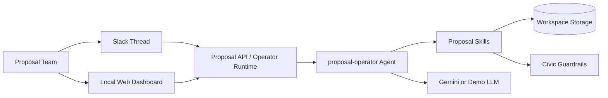

# Proposal Helmsman

AI proposal operations for Slack-first teams, powered by an OpenClaw-style runtime and Civic guardrails.


## Description

Proposal Helmsman is an MVP for teams that respond to RFPs, tenders, and proposal requests in Slack. It ingests pasted RFP text, extracts requirements, plans a proposal structure, drafts and revises sections, tracks requirement coverage, and exports a combined proposal draft. The project is designed for hackathon and prototype teams that want a fast path to an auditable AI proposal workflow with tool and output guardrails.

## Table of Contents

- [Features](#features)
- [Tech Stack](#tech-stack)
- [Architecture Overview](#architecture-overview)
- [Installation](#installation)
- [Usage](#usage)
- [Configuration](#configuration)
- [Screenshots / Demo](#screenshots--demo)
- [API / CLI Reference](#api--cli-reference)
- [Tests](#tests)
- [Roadmap](#roadmap)
- [Contributing](#contributing)
- [License](#license)
- [Contact / Support](#contact--support)

## Features

- Slack-first proposal workflow with thread-to-workspace mapping.
- OpenClaw-style `proposal-operator` agent with a configurable model client.
- RFP parsing into summary and structured requirement checklist data.
- Proposal structure planning for standard response sections.
- Section drafting and revision workflows with Civic tool and output guardrails.
- Requirement coverage tracking with evidence extracted from drafted sections.
- Markdown export for the assembled proposal draft.
- ElevenLabs-powered audio briefings for summaries, sections, and exported proposal drafts.
- Local browser dashboard for demoing intake, drafting, coverage, trust state, and export.
- Thin serverless API handlers for Vercel-style deployment targets.
- Slack request signing verification and duplicate event protection.

## Tech Stack

- Node.js 24+
- TypeScript executed with Node `--experimental-strip-types`
- OpenClaw-style local runtime scaffold
- Gemini-compatible model client
- Civic guardrails integration
- Slack Events API compatible handler example
- Plain HTML, CSS, and JavaScript frontend
- Node `test` runner for automated coverage
- Filesystem or Modal-mounted volume storage for workspaces

## Architecture Overview



Proposal Helmsman exposes the same operator workflow through Slack events, a browser dashboard, and CLI entrypoints. The backend routes requests into the `proposal-operator`, which coordinates proposal skills, stores workspace state on disk or a mounted volume, and calls external model and guardrail services when configured.

## Installation

### Prerequisites

- Node.js `24` or newer
- `npm` for package scripts
- Optional: Gemini API access
- Optional: Civic guardrail endpoint and API key
- Optional: Slack app credentials for signed event handling

### Setup

1. Clone the repository.

```bash
git clone <ADD_REPOSITORY_URL>
cd proposal-helmsman
```

2. Install development dependencies.

```bash
npm install
```

3. Copy the environment template.

```bash
cp .env.example .env
```

4. Update `.env` with the credentials and storage settings you want to use.

5. Start the local web app.

```bash
npm run dev
```

6. Open the local dashboard.

```text
http://127.0.0.1:3000
```

## Usage

### Run the Local Dashboard

```bash
npm run dev
```

The dashboard supports workspace creation, RFP parsing, structure planning, drafting, revision, coverage refresh, export, and markdown download.

### Run the Proposal Operator from the CLI

```bash
npm run agent -- ./workspaces/proposals/demo "/status"
```

### Run Individual Skills

Parse a sample RFP:

```bash
mkdir -p workspaces/proposals/demo
cp openclaw/examples/demo/sample-rfp.txt workspaces/proposals/demo/rfp.txt
npm run skill -- parse_rfp ./workspaces/proposals/demo @openclaw/examples/demo/parse-rfp.json
```

Plan the proposal structure:

```bash
npm run skill -- plan_proposal_structure ./workspaces/proposals/demo
```

Draft the executive summary:

```bash
npm run skill -- draft_section ./workspaces/proposals/demo @openclaw/examples/demo/draft-executive-summary.json
```

Revise a section through guardrails:

```bash
npm run skill -- revise_section ./workspaces/proposals/demo @openclaw/examples/demo/modified-revise.json
```

Export the combined proposal:

```bash
npm run skill -- export_proposal ./workspaces/proposals/demo
```

Generate a narrated summary briefing:

```bash
npm run skill -- generate_audio_briefing ./workspaces/proposals/demo @openclaw/examples/demo/audio-summary.json
```

### Practical API Example

Create or update a workspace through the local API:

```bash
curl -X POST http://127.0.0.1:3000/api/message \
  -H "content-type: application/json" \
  -d '{
    "workspaceId": "demo-thread",
    "message": "/draft Executive Summary"
  }'
```

## Configuration

The project is configured primarily through environment variables and the OpenClaw-style agent config in `openclaw/agents/proposal-operator/config.yaml`.

### Core Environment Variables

| Variable | Description | Example |
| --- | --- | --- |
| `OPENCLAW_MODEL_PROVIDER` | Model provider selector | `google` |
| `OPENCLAW_MODEL` | Model name for the runtime | `gemini-2.5-flash` |
| `OPENCLAW_TEMPERATURE` | Drafting temperature | `0.4` |
| `OPENCLAW_MODEL_TIMEOUT_MS` | Model call timeout in milliseconds | `20000` |
| `GEMINI_API_KEY` | Gemini API key | `<ADD_GEMINI_API_KEY>` |
| `CIVIC_GUARD_URL` | Civic guardrail endpoint base URL | `https://your-civic-guard.example` |
| `CIVIC_API_KEY` | Civic API key | `<ADD_CIVIC_API_KEY>` |
| `CIVIC_MOCK_MODE` | Use mock guardrail behavior for demos | `true` |
| `CIVIC_GUARD_TIMEOUT_MS` | Civic timeout in milliseconds | `8000` |
| `SLACK_SIGNING_SECRET` | Slack request signing secret | `<ADD_SLACK_SIGNING_SECRET>` |
| `ELEVENLABS_API_KEY` | ElevenLabs API key | `<ADD_ELEVENLABS_API_KEY>` |
| `ELEVENLABS_VOICE_ID` | ElevenLabs voice identifier | `<ADD_ELEVENLABS_VOICE_ID>` |
| `ELEVENLABS_MODEL_ID` | ElevenLabs text-to-speech model | `eleven_multilingual_v2` |
| `ELEVENLABS_OUTPUT_FORMAT` | ElevenLabs output format | `mp3_44100_128` |
| `ELEVENLABS_TIMEOUT_MS` | ElevenLabs timeout in milliseconds | `20000` |
| `ELEVENLABS_MOCK_MODE` | Use deterministic local mock audio | `true` |
| `PROPOSAL_STORAGE_MODE` | Storage mode | `local` or `modal` |
| `PROPOSAL_WORKSPACE_ROOT` | Override workspace root | `/absolute/path/to/workspaces` |
| `MODAL_VOLUME_PATH` | Mounted volume base path for durable storage | `/vol/proposal-helmsman` |

### Notes

- If `GEMINI_API_KEY` is not set, the runtime falls back to the deterministic demo LLM.
- If `CIVIC_MOCK_MODE=true`, Civic behavior is simulated for local demos.
- If ElevenLabs credentials are missing or `ELEVENLABS_MOCK_MODE=true`, audio generation falls back to a deterministic mock WAV artefact for local testing.
- The Slack handler fails closed unless `SLACK_SIGNING_SECRET` is set.
- Health checks report the active storage mode and workspace root posture.

## Screenshots / Demo


- Live demo: `<ADD_LIVE_DEMO_URL>`
- Local demo URL: `http://127.0.0.1:3000`

If you do not want broken image links in GitHub, replace the placeholder paths above with real screenshots or remove them.

## API / CLI Reference

### CLI Commands

| Command | Purpose |
| --- | --- |
| `npm run dev` | Start the local dashboard and API server |
| `npm run agent -- <workspacePath> "<message>"` | Invoke the proposal operator directly |
| `npm run skill -- parse_rfp <workspacePath> <input>` | Parse RFP text or a workspace file |
| `npm run skill -- plan_proposal_structure <workspacePath>` | Generate `structure.json` |
| `npm run skill -- draft_section <workspacePath> <input>` | Draft a proposal section |
| `npm run skill -- revise_section <workspacePath> <input>` | Revise a section through guardrails |
| `npm run skill -- update_checklist_coverage <workspacePath>` | Refresh requirement coverage |
| `npm run skill -- export_proposal <workspacePath>` | Generate `proposal.md` |
| `npm run skill -- generate_audio_briefing <workspacePath> <input>` | Generate a spoken briefing artefact |
| `npm run skill -- workspace_status <workspacePath>` | Return current workspace state |

### HTTP Endpoints

| Method | Endpoint | Purpose |
| --- | --- | --- |
| `GET` | `/api/health` | Health and storage posture |
| `GET` | `/api/sample-rfp` | Sample RFP text for demos |
| `GET` | `/api/workspaces` | List known workspaces |
| `GET` | `/api/status?workspaceId=<id>` | Current workspace snapshot |
| `GET` | `/api/proposal?workspaceId=<id>` | Download exported proposal markdown |
| `GET` | `/api/audio?workspaceId=<id>&file=<optional-file>` | Download the latest or a named audio briefing |
| `POST` | `/api/message` | Send an operator message |
| `POST` | `/api/audio` | Generate an audio briefing for a workspace |
| `POST` | `/api/reset` | Reset a workspace |
| `POST` | `/api/slack` | Slack-compatible signed event entrypoint |

### Slack Handler Example

The Slack example maps `(channelId, threadId)` to `./workspaces/proposals/<channel>_<thread>` and supports:

- Slack `url_verification`
- Signed message events
- Bot-loop avoidance
- Duplicate `event_id` suppression
- Commands such as `/parse`, `/draft`, `/revise`, `/coverage`, `/export`, and `/status`

## Tests

Run the automated test suite:

```bash
npm run test
```

Run static type checking:

```bash
npm run typecheck
```

Test coverage currently uses the built-in Node `test` runner and includes proposal flows, guardrails, serverless routes, Slack signature verification, idempotency, storage resolution, and coverage regression checks.

## Roadmap

- Add durable remote execution and storage beyond local files or mounted volumes.
- Replace heuristic requirement coverage with a two-stage retrieval and reranking pipeline.
- Support richer export formats such as DOCX and PDF.
- Add richer spoken outputs such as Slack voice updates and multi-voice handoff narration.
- Add richer Slack thread updates and approval workflows.
- Align the local runtime scaffold with the exact OpenClaw SDK used in deployment.

## Contributing

Contributions are welcome.

1. Fork the repository.
2. Create a feature branch.
3. Make focused changes with tests where appropriate.
4. Run `npm run test` before opening a pull request.
5. Open a PR with a clear summary, rationale, and any screenshots for UI changes.

Please open issues or pull requests in `<ADD_GITHUB_REPOSITORY_URL>`.

## License

License: `<ADD LICENSE TYPE HERE>`

This repository does not currently include a root `LICENSE` file. Add `LICENSE` at the repository root and update this section before publishing publicly.

## Contact / Support

- Maintainer: `<ADD MAINTAINER NAME>`
- GitHub: `<ADD_GITHUB_PROFILE_OR_REPOSITORY_URL>`
- Website: `<ADD_WEBSITE_URL>`
- Email: `<ADD_EMAIL_ADDRESS>`

For support, issues, or feature requests, use the repository issue tracker at `<ADD_GITHUB_REPOSITORY_URL>/issues`.
