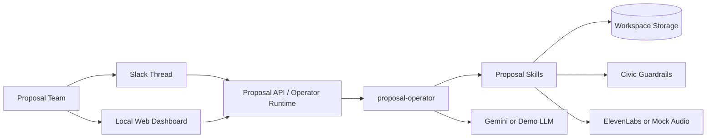

## Description

Proposal Helmsman is a multi‑platform AI proposal operator, built on top of OpenClaw, that takes teams from a new RFP to a structured, guardrailed draft proposal in one workflow. Users can interact with it in Slack or Telegram (and other chat channels supported by OpenClaw), and it always applies the same guardrail policies regardless of where the request comes from. When a user drops or pastes an RFP into a channel and mentions the agent, it creates a dedicated workspace, reads the RFP, summarises it, and extracts a structured list of must‑have and nice‑to‑have requirements. It then plans a full proposal outline (Executive Summary, Approach, Delivery Plan, Team, Data Privacy & Security, Commercials, etc.) and can draft and revise each section on request, while maintaining a live checklist showing which requirements are already covered. Under the hood, Proposal Helmsman runs as an OpenClaw agent with skills for parsing, planning, drafting, revising, coverage analysis, and export to a single proposal document. Civic guardrails wrap user instructions, tool calls, and generated outputs, so the same rules block or rewrite unsafe requests—like promising unlimited liability or exposing internal client lists—on every platform before they ever reach the final draft.

## Table of Contents

- [Description](#description)
- [Features](#features)
- [Tech Stack](#tech-stack)
- [Architecture Overview](#architecture-overview)
- [Installation](#installation)
- [Usage](#usage)
- [Configuration](#configuration)
- [Screenshots / Demo](#screenshots--demo)
- [API / CLI Reference](#api--cli-reference)
- [Tests](#tests)
- [Roadmap](#roadmap)
- [Contributing](#contributing)
- [License](#license)
- [Contact / Support](#contact--support)

## Features

- Slack-first proposal workflow with thread-to-workspace mapping.
- Local browser dashboard for RFP intake, drafting, coverage review, trust state, and export.
- OpenClaw-style `proposal-operator` runtime with skill-based orchestration.
- RFP parsing into summary and structured requirement checklist data.
- Proposal structure planning for standard response sections.
- Draft, revise, and export flows with Civic input, tool, and output guardrails.
- Requirement coverage tracking with evidence mapped back to drafted sections.
- Markdown proposal export and downloadable output.
- ElevenLabs-powered audio briefing generation with deterministic mock mode for local demos.
- Thin serverless API handlers for Vercel-style deployment targets.
- Signed Slack event handling with duplicate-event protection.

## Tech Stack

- Node.js `24+`
- TypeScript
- Node `--experimental-strip-types`
- Plain HTML, CSS, and JavaScript frontend
- OpenClaw-style local runtime scaffold
- Gemini-compatible model client
- Civic guardrails integration
- ElevenLabs text-to-speech integration
- Slack Events API-compatible webhook handler
- Node built-in `test` runner
- Local filesystem or Modal-mounted volume workspace storage

## Architecture Overview



Proposal Helmsman exposes the same workflow through Slack, a browser dashboard, and CLI entrypoints. Requests are routed through the proposal operator, which coordinates skill modules, persists workspace artefacts, and calls external model, guardrail, and audio services when they are configured.

## Installation

### Prerequisites

- Node.js `24` or newer
- `npm`
- Optional: Gemini API credentials
- Optional: Civic guardrail endpoint and API key
- Optional: ElevenLabs credentials
- Optional: Slack app signing secret

### Setup

1. Clone the repository.

```bash
git clone git@github.com:MasteraSnackin/Proposal-Helmsman.git
cd Proposal-Helmsman
```

2. Install dependencies.

```bash
npm install
```

3. Create your local environment file.

```bash
cp .env.example .env
```

4. Update `.env` with the services and storage mode you want to use.

5. Start the local dashboard and API server.

```bash
npm run dev
```

6. Open the app in your browser.

```text
http://127.0.0.1:3000
```

## Usage

### Run the Local Dashboard

```bash
npm run dev
```

The dashboard supports workspace creation, RFP parsing, structure planning, section drafting, revision, coverage refresh, export, and markdown download.

### Run the Proposal Operator from the CLI

```bash
npm run agent -- ./workspaces/proposals/demo "/status"
```

### Run Individual Skills

Parse a sample RFP:

```bash
mkdir -p workspaces/proposals/demo
cp openclaw/examples/demo/sample-rfp.txt workspaces/proposals/demo/rfp.txt
npm run skill -- parse_rfp ./workspaces/proposals/demo @openclaw/examples/demo/parse-rfp.json
```

Plan the proposal structure:

```bash
npm run skill -- plan_proposal_structure ./workspaces/proposals/demo
```

Draft the executive summary:

```bash
npm run skill -- draft_section ./workspaces/proposals/demo @openclaw/examples/demo/draft-executive-summary.json
```

Revise a section:

```bash
npm run skill -- revise_section ./workspaces/proposals/demo @openclaw/examples/demo/modified-revise.json
```

Export the combined proposal:

```bash
npm run skill -- export_proposal ./workspaces/proposals/demo
```

Generate a narrated briefing:

```bash
npm run skill -- generate_audio_briefing ./workspaces/proposals/demo @openclaw/examples/demo/audio-summary.json
```

### Practical API Example

```bash
curl -X POST http://127.0.0.1:3000/api/message \
  -H "content-type: application/json" \
  -d '{
    "workspaceId": "demo-thread",
    "message": "/draft Executive Summary"
  }'
```

## Configuration

The main runtime settings live in `.env.example` and `openclaw/agents/proposal-operator/config.yaml`.

### Core Environment Variables

| Variable | Description | Example |
| --- | --- | --- |
| `OPENCLAW_MODEL_PROVIDER` | Model provider selector | `google` |
| `OPENCLAW_MODEL` | Model name for the runtime | `gemini-2.5-flash` |
| `OPENCLAW_TEMPERATURE` | Drafting temperature | `0.4` |
| `OPENCLAW_MODEL_TIMEOUT_MS` | Model timeout in milliseconds | `20000` |
| `GEMINI_API_KEY` | Gemini API key | `<ADD_GEMINI_API_KEY>` |
| `CIVIC_GUARD_URL` | Civic guardrail endpoint base URL | `https://your-civic-guard.example` |
| `CIVIC_API_KEY` | Civic API key | `<ADD_CIVIC_API_KEY>` |
| `CIVIC_MOCK_MODE` | Use mock guardrail behavior for demos | `true` |
| `CIVIC_FAIL_OPEN` | Allow requests if Civic fails | `false` |
| `CIVIC_GUARD_TIMEOUT_MS` | Civic timeout in milliseconds | `8000` |
| `SLACK_SIGNING_SECRET` | Slack signing secret | `<ADD_SLACK_SIGNING_SECRET>` |
| `ELEVENLABS_API_KEY` | ElevenLabs API key | `<ADD_ELEVENLABS_API_KEY>` |
| `ELEVENLABS_VOICE_ID` | ElevenLabs voice identifier | `<ADD_ELEVENLABS_VOICE_ID>` |
| `ELEVENLABS_MODEL_ID` | ElevenLabs model identifier | `eleven_multilingual_v2` |
| `ELEVENLABS_OUTPUT_FORMAT` | ElevenLabs output format | `mp3_44100_128` |
| `ELEVENLABS_TIMEOUT_MS` | ElevenLabs timeout in milliseconds | `20000` |
| `ELEVENLABS_MOCK_MODE` | Use deterministic mock audio locally | `true` |
| `PROPOSAL_STORAGE_MODE` | Workspace storage mode | `local` or `modal` |
| `PROPOSAL_WORKSPACE_ROOT` | Override workspace root | `/absolute/path/to/workspaces` |
| `MODAL_VOLUME_PATH` | Mounted Modal volume base path | `/vol/proposal-helmsman` |

### Notes

- If `GEMINI_API_KEY` is not set, the runtime falls back to the deterministic demo LLM.
- If `CIVIC_MOCK_MODE=true`, guardrails are simulated for local demos.
- If ElevenLabs credentials are missing or `ELEVENLABS_MOCK_MODE=true`, audio generation falls back to a deterministic mock WAV artefact.
- The Slack handler fails closed unless `SLACK_SIGNING_SECRET` is configured.
- Local filesystem storage is suitable for development demos; durable deployment storage needs an external mounted or remote-backed path.

## Screenshots / Demo


- Live demo: `<ADD_LIVE_DEMO_URL>`
- Local demo URL: `http://127.0.0.1:3000`

## API / CLI Reference

### CLI Commands

| Command | Purpose |
| --- | --- |
| `npm run dev` | Start the local dashboard and API server |
| `npm run agent -- <workspacePath> "<message>"` | Invoke the proposal operator directly |
| `npm run skill -- parse_rfp <workspacePath> <input>` | Parse RFP text or a workspace file |
| `npm run skill -- plan_proposal_structure <workspacePath>` | Generate `structure.json` |
| `npm run skill -- draft_section <workspacePath> <input>` | Draft a proposal section |
| `npm run skill -- revise_section <workspacePath> <input>` | Revise a section through guardrails |
| `npm run skill -- update_checklist_coverage <workspacePath>` | Refresh requirement coverage |
| `npm run skill -- export_proposal <workspacePath>` | Generate `proposal.md` |
| `npm run skill -- generate_audio_briefing <workspacePath> <input>` | Generate a spoken briefing artefact |
| `npm run skill -- workspace_status <workspacePath>` | Return current workspace state |

### HTTP Endpoints

| Method | Endpoint | Purpose |
| --- | --- | --- |
| `GET` | `/api/health` | Health, model, audio, and storage posture |
| `GET` | `/api/sample-rfp` | Sample RFP text for demos |
| `GET` | `/api/workspaces` | List known workspaces |
| `GET` | `/api/status?workspaceId=<id>` | Current workspace snapshot |
| `GET` | `/api/proposal?workspaceId=<id>` | Download exported proposal markdown |
| `GET` | `/api/audio?workspaceId=<id>&file=<optional-file>` | Download the latest or a named audio briefing |
| `POST` | `/api/message` | Send an operator message |
| `POST` | `/api/audio` | Generate an audio briefing for a workspace |
| `POST` | `/api/reset` | Reset a workspace |
| `POST` | `/api/slack` | Slack-compatible signed event entrypoint |

### Slack Handler Example

The Slack example maps `(channelId, threadId)` to `./workspaces/proposals/<channel>_<thread>` and supports:

- Slack `url_verification`
- Signed message events
- Bot-loop avoidance
- Duplicate `event_id` suppression
- Commands such as `/parse`, `/draft`, `/revise`, `/coverage`, `/export`, and `/status`

## Tests

Run the automated test suite:

```bash
npm test
```

Run static type checking:

```bash
npm run typecheck
```

The project uses the built-in Node `test` runner and covers proposal flows, guardrails, serverless routes, storage resolution, Slack signing, idempotency, and coverage regressions.

## Roadmap

- Add durable remote storage suitable for hosted deployments.
- Add deployment-ready Vercel configuration for the browser UI and API routes.
- Support richer export targets such as DOCX and PDF.
- Improve requirement coverage with stronger retrieval and matching.
- Expand Slack review, approval, and audit workflows.
- Align the local runtime scaffold with the exact OpenClaw SDK used in deployment.

## Contributing

Contributions are welcome.

1. Fork the repository.
2. Create a feature branch.
3. Make focused changes with tests where appropriate.
4. Run `npm test` and `npm run typecheck` before opening a pull request.
5. Open a pull request with a clear summary, rationale, and screenshots for UI changes when helpful.

Issues and pull requests should be opened at:

- Repository: https://github.com/MasteraSnackin/Proposal-Helmsman
- Issues: https://github.com/MasteraSnackin/Proposal-Helmsman/issues

## License

License: `<ADD LICENSE TYPE HERE>`

Add a root `LICENSE` file and replace the placeholder above before public release.

## Contact / Support

- Maintainer: `MasteraSnackin`
- GitHub: https://github.com/MasteraSnackin
- Repository: https://github.com/MasteraSnackin/Proposal-Helmsman
- Website: `<ADD_WEBSITE_URL>`
- Email: `<ADD_EMAIL_ADDRESS>`

For support, bug reports, or feature requests, use the issue tracker:

- https://github.com/MasteraSnackin/Proposal-Helmsman/issues
