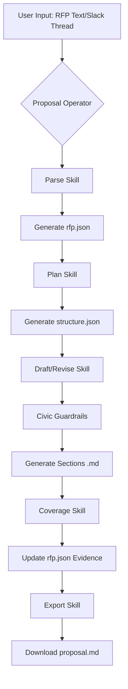
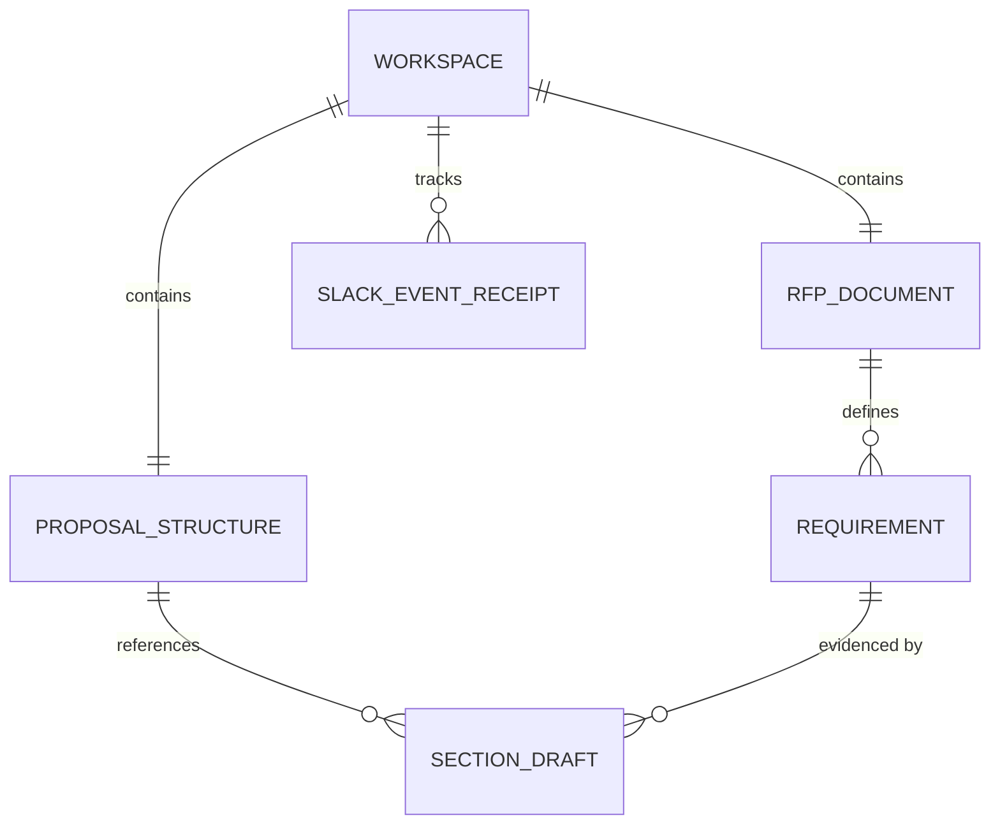
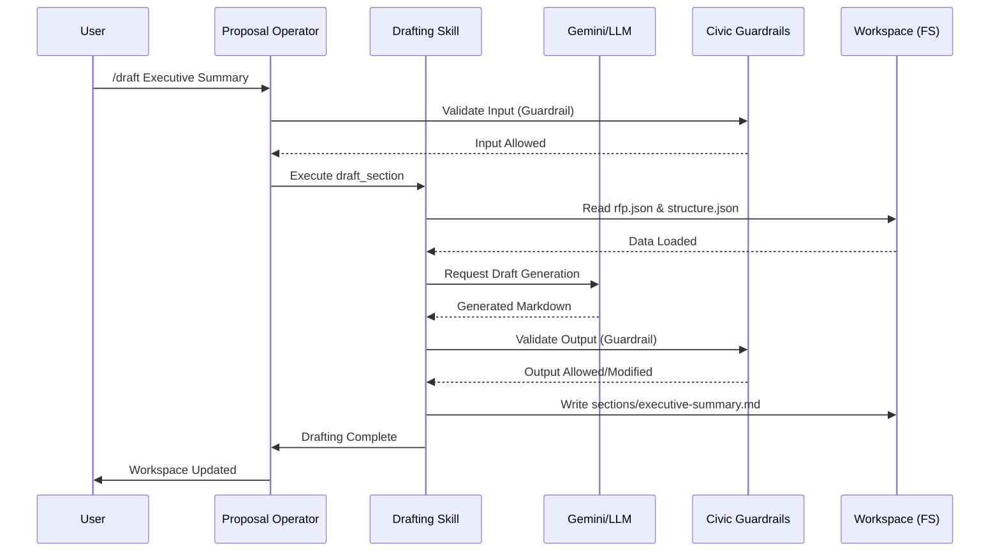

# Project Diagrams: Proposal Helmsman

This document provides visual representations of the Proposal Helmsman architecture, data flow, and sequence of operations.

## System Flow Diagram
The following flow diagram illustrates the high-level process from RFP ingestion to final proposal export.

## Data Model Diagram
This diagram shows the relationships between the key data entities stored within a workspace.

## Sequence Diagram: Section Drafting & Guardrails
This sequence diagram details the interaction between the operator, skills, and external services during a typical drafting and revision workflow.

